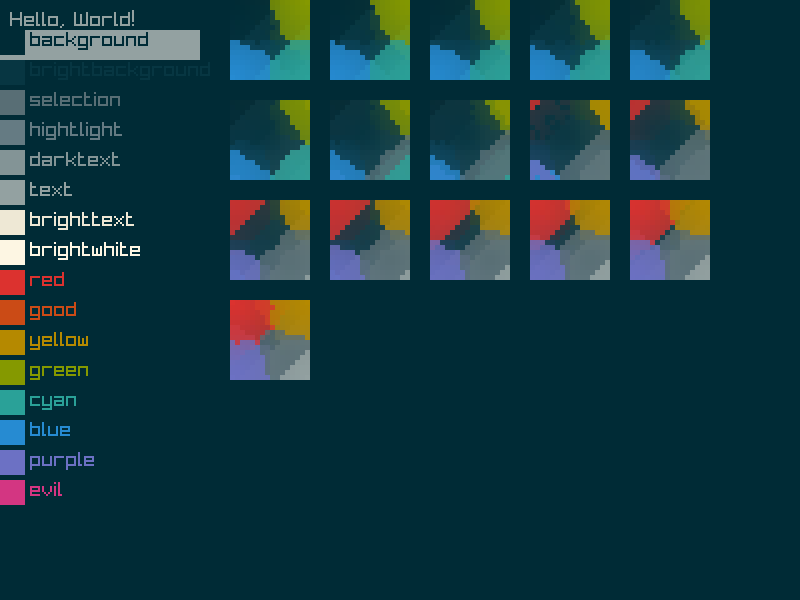
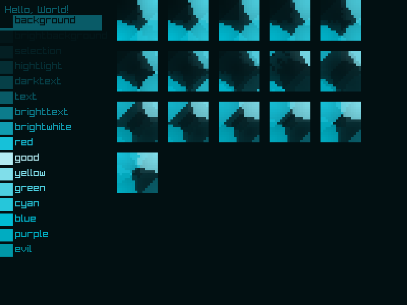
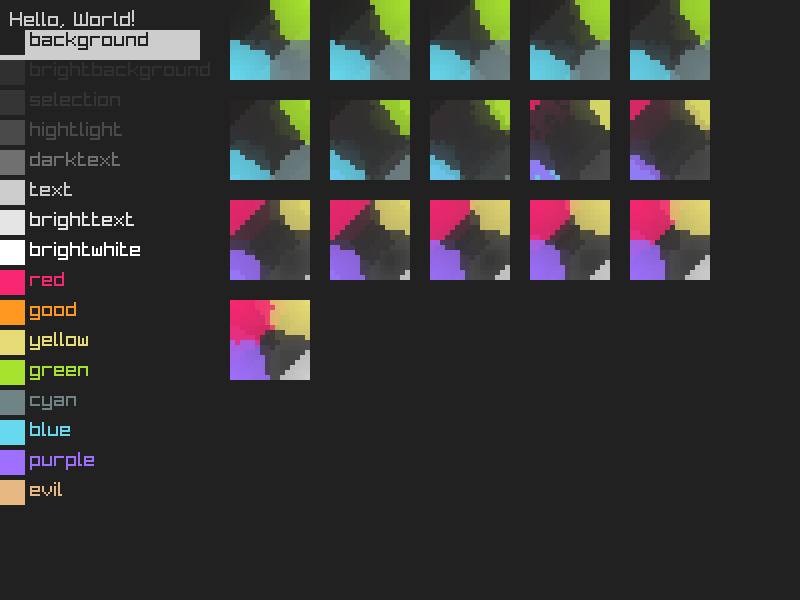
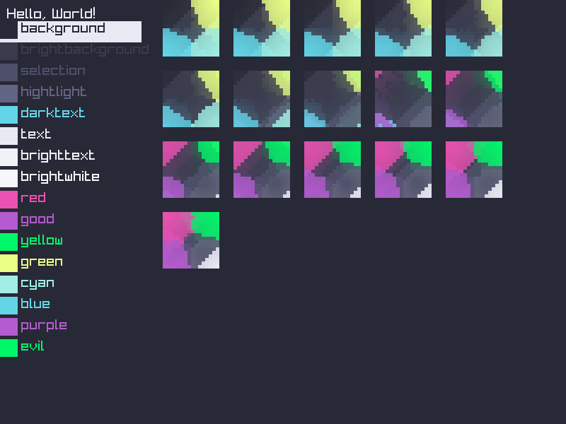

A failed experiment, I was attempting to make a color space from a user defined base 16 config

I tried and just failed to understand 3d berycentric cords I just couldnt find a version for 3d I understood and my attempts at trasforming the easy to understand 2d versions just didnt work, my hack sorta worked but its less then ideal

anyway, if I ever link this along with my idea for a markup languge this is what I mean for a colors:

1. user defined fixed points for a handful of colors

2. Some flexablity on colors, so you could have a "red tinted background" even if its not defined

3. No "tmoble purple" or other advertiser or graphic design bullshit being allowed by the spec

4. "Programmer art", doesnt happen for colors, assuming users picked a theme

